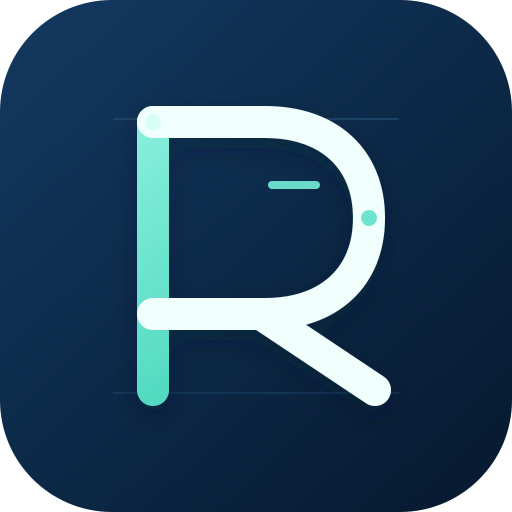
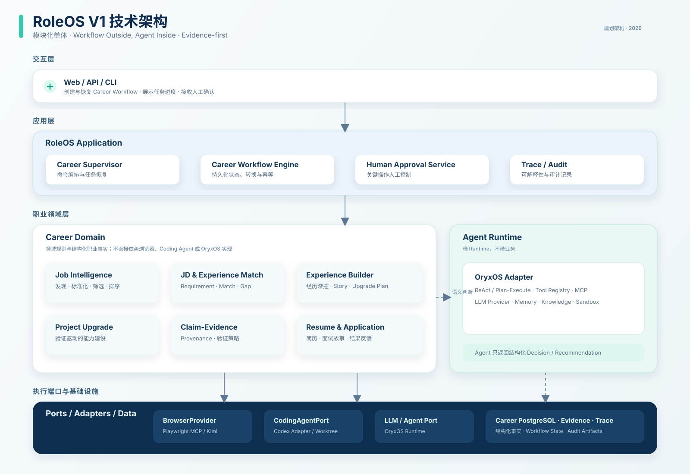

# RoleOS

<p align="center">
  
</p>

> 面向 AI 应用开发与 AI Agent 开发岗位的职业智能体（AI Career Agent）。
RoleOS 以目标岗位为中心，连接岗位发现、JD 分析、真实经历匹配、项目升级、证据沉淀、简历生成、面试准备、人工确认与投递反馈，帮助求职者持续提升与目标岗位的**真实匹配度**。

> **核心原则：Never fabricate experience. Upgrade experience until the claim becomes true.**
>
> 不虚构经历；当能力存在差距时，通过真实的项目升级、测试和证据沉淀，使简历中的陈述成为可验证的事实。

## 项目状态

> 🧩 **Career Foundation 已交付；其余 V1 能力仍按路线图推进。**

当前已交付职业档案与资产、受控 Fake 导入审阅、技能多来源与可信度视图、PostgreSQL 持久化工作流、审批恢复及对应 REST 契约。该范围用于建立真实性、来源、归属与人工确认边界；尚未交付真实简历解析、岗位获取/分析、项目升级、简历生成或正式投递。请以 [`docs/`](./docs) 和 Feature [验证指南](./specs/001-career-foundation/quickstart.md) 为准。

## 为什么是 RoleOS

求职不应只是“抓取更多岗位并投递更多简历”。真正关键的问题是：如何让用户针对具体岗位，真实地补齐能力、提升项目深度，并形成经得起追问的简历与面试故事。

RoleOS 解决的是下面这条职业能力闭环：

```text
真实岗位
  → JD 分析
  → 经历匹配
  → Gap 分析
  → 经历深挖
  → 项目升级
  → Evidence
  → 简历 / 面试故事
  → 人工确认
  → 投递
  → 结果反馈
```

它不是：

- 大规模招聘网站爬虫；
- 无人值守的海投工具；
- 只改写文字的简历润色器；
- Coding Agent 的替代品。

## 核心能力

| 能力 | 说明 |
| --- | --- |
| **Job Intelligence** | 发现、标准化、筛选、去重、分析并排序真实岗位。 |
| **JD & Experience Match** | 将 JD Requirement 与用户的 Experience / Project 进行匹配，识别匹配度与缺口。 |
| **Experience Builder** | 通过有针对性的追问，挖掘真实经历中的业务背景、技术决策、结果与可讲述故事。 |
| **Project Upgrade** | 在用户确认后调用 Coding Agent 升级真实项目，并通过构建、测试、评测与产物检查验证结果。 |
| **Claim-Evidence** | 为简历和面试陈述建立可追溯的事实与证据链。 |
| **Resume & Interview** | 面向目标 Role 或具体 Job 生成简历版本和一致的面试故事。 |
| **Application & Feedback** | 在人工确认下辅助投递，记录结果并反馈到 Career Memory 与后续策略。 |

## 核心设计原则

- **Target Role First**：所有优化围绕具体目标岗位展开。
- **Evidence First**：重要能力、结果和 Claim 尽量由真实 Evidence 支撑。
- **Upgrade Before Rewrite**：发现真实 Skill Gap 时，优先补齐能力，而不是用文字掩盖。
- **Workflow Outside, Agent Inside**：持久化流程与状态由代码控制；语义理解、规划与判断由 Agent 完成。
- **Agent for Judgment, Code for Rules**：筛选、去重、状态机、幂等等确定性规则由代码实现。
- **Database 管事实，Memory 管上下文**：结构化职业事实持久化到 Career Database；偏好和对话上下文保留在 Agent Memory。
- **Human in Control**：经历真实性、项目重大改造、最终简历和正式投递均保留人工确认。
- **Explainable by Design**：推荐、差距判断、项目升级和简历调整都应能够说明原因。

## 真实性与安全边界

RoleOS 对职业事实和对外操作采取严格约束：

- 不将 Agent 推理自动写成用户事实；所有关键事实和 Claim 必须带有来源（Provenance）。
- 不虚构客户、用户数、收入、生产规模、性能指标或历史经历。
- 明确区分 `Portfolio Project` 与 `Production Experience`，以及设计场景与真实公司场景。
- `Codex completed` 不等于项目升级完成；必须通过独立的 Build、Test、Evaluation 和 Artifact Check。
- 简历默认仅使用 `VERIFIED` 或 `SUPPORTED` Claim，拒绝 `UNSUPPORTED` Claim。
- 涉及投递、发送消息、验证码和未知外部副作用时，必须暂停并等待人工确认；不得盲目重试。

## 架构概览

RoleOS V1 采用**模块化单体 + 外部执行能力**的架构：



```text
RoleOS Spring Boot Application
│
├── Career Domain
│   ├── Job Intelligence
│   ├── Experience Builder
│   ├── Project Upgrade
│   ├── Claim-Evidence
│   ├── Resume / Application
│   └── Durable Career Workflow
│
├── Agent Runtime
│   └── OryxOS（ReAct / Tool / MCP / Memory）
│
├── Execution Ports
│   ├── BrowserProvider → Playwright MCP / Kimi Browser Extension
│   ├── CodingAgentPort → Codex Adapter
│   └── LLM / Agent Port → OryxOS Adapter
│
└── Data
    ├── Career PostgreSQL
    ├── Git Worktree / Project Repository
    ├── Evaluation Artifacts
    └── Trace / Audit
```

### 边界约束

- RoleOS 自己维护 Career Domain 和可暂停、可恢复的持久化 Workflow；OryxOS 是可替换的 Agent Runtime，而非业务工作流。
- Career Domain 通过 Port/Adapter 使用浏览器、Coding Agent 和 LLM，不能直接依赖 Playwright、Kimi、Codex 或 OryxOS 的具体实现。
- 浏览器固定分层：`Career Domain → JobSiteAdapter → BrowserRouter → BrowserProvider`。
- 外部能力优先按 `Port → Fake Adapter → Contract Test → Real Adapter` 的顺序接入。

### OpenAI 与 OpenAPI 的边界

`OpenAPI` 是 RoleOS 对外 REST 接口的契约与文档，由 `roleos-web` 提供；`OpenAI API` 是模型
推理服务接口。两者不是同一层。

- 职业对话、JD 分析、经历匹配和语义判断走 `AgentRuntimePort → OryxOS Adapter → 模型 Provider`。
- 真实项目升级走 `CodingAgentPort → Codex Adapter → Git Worktree / 工具执行环境`。
- 两条链路可以使用同一模型提供商，但必须分离权限、成本、Trace 和业务职责：OryxOS 不改代码，
  Codex 不改 Workflow State 或 Career Fact。

## 技术栈

| 层级 | 技术选型 |
| --- | --- |
| 语言与应用 | Java 21、Spring Boot 3.x、Spring MVC、OpenAPI |
| 构建 | Maven 多模块 |
| 持久化 | PostgreSQL、Spring Data JPA、Flyway |
| Agent Runtime | OryxOS、ReAct / Plan-Execute、MCP |
| 浏览器执行 | Playwright MCP；Kimi Browser Extension 作为备用适配器 |
| Coding Agent | Codex，通过 `CodingAgentPort` 接入 |
| 可观测性 | SLF4J、Micrometer、Trace ID |
| 测试 | JUnit、Testcontainers、Agent/Adapter Contract Test |

## V1 范围

V1 目标是在 6～8 周内跑通一个真实的端到端闭环：

```text
真实 Job + 真实 Career Profile + 真实 Project Repository
  → JD Requirement
  → Experience Match / Gap
  → Experience Mining
  → Codex Project Upgrade
  → Test / Eval / Evidence
  → Job-specific Resume / Interview Story
  → Human Approval
  → Application / Outcome Feedback
```

V1 明确不追求：

- 多招聘网站覆盖与无人值守批量投递；
- 绕过验证码或平台风控；
- 自研 Browser Runtime、Coding Agent 或通用 Workflow Engine；
- 复杂 Multi-Agent Network、完整 Career Knowledge Graph、Graph DB 或微服务拆分；
- 在没有真实验证前宣称“企业级”能力。

## 开发路线图

| 阶段 | 交付目标 |
| --- | --- |
| **US-1：Career Foundation** | **已交付**：Career Profile/资产、Fake 导入确认、技能来源、持久化 Workflow 与审批恢复。 |
| **US-2：Job Intelligence** | Job Source、标准化、筛选、Broad / Targeted 策略和排序。 |
| **US-3：Match & Gap** | Requirement 抽取、轻量/深度匹配及 Story / Skill / Evidence Gap。 |
| **US-4：Experience Builder** | 经历深挖、动态追问、结构化 Experience Asset 与人工确认。 |
| **US-5：Project Upgrade** | Upgrade Plan、Codex Adapter、独立验证和 Evidence 采集。 |
| **US-6：Claim & Resume** | Claim-Evidence 策略、简历版本和面试故事。 |
| **US-7：Application & Feedback** | 投递准备、人工确认、结果跟踪与反馈闭环。 |
| **Golden Scenario** | 使用真实岗位、经历与项目稳定跑通完整闭环。 |

## 仓库结构

```text
.
├── AGENTS.md                         # 仓库级智能体执行规范
├── README.md                         # 项目入口文档
├── docs/
│   ├── AI_Career_Agent_深度调研与技术架构报告_专业版.md
│   ├── RoleOS需求文档.md
│   ├── RoleOS技术方案.md
│   └── RoleOS_AI编程指南.md
├── .specify/                         # Spec Kit 规格与章程
└── .agents/skills/                   # 本地 Spec Kit 工作流技能
```

工程地基已初始化为 15 个 Maven 模块，包括 `roleos-domain`、`roleos-application`、`roleos-workflow`、`roleos-job`、`roleos-experience`、`roleos-upgrade`、`roleos-evidence`、`roleos-resume`、`roleos-application-tracking`、`roleos-browser`、`roleos-codex`、`roleos-runtime-oryx`、`roleos-storage`、`roleos-web` 与 `roleos-boot`。Career Foundation 的职业业务能力已在上述边界内实现；后续故事保持按 Spec Kit 逐步交付。

## 本地启动与质量门禁

前置条件：JDK 21、Maven 3.9+、Docker Compose。首次启动前复制本地配置并启动 PostgreSQL：

```bash
bash scripts/dev-up.sh
```

该脚本会在 `.env` 不存在时从 `.env.example` 创建本地配置，启动并等待 PostgreSQL 健康，构建 `roleos-boot` 可执行 JAR 后以前台方式运行。按 `Ctrl+C` 停止应用；数据库容器仍会保留，可使用 `docker compose down` 停止。

服务启动后可通过 `http://localhost:8080/actuator/health` 确认健康状态。数据库和应用连接信息均由 `.env` 中的 `ROLEOS_*` 环境变量提供；`.env` 已被 Git 忽略，示例密码只适用于本机开发，绝不能复用到共享或生产环境。

完整质量门禁（格式、静态分析、依赖安全检查与测试）使用：

```bash
set -a
source .env
set +a
mvn -B -ntp -Pquality verify
```

首次参与开发还应安装仓库 Git 钩子：

```bash
bash scripts/install-git-hooks.sh
```

该钩子会在本机安装 `gitleaks` 时扫描暂存区；无该工具时会提示并交由 CI 强制扫描。请勿将 API Key、数据库密码、私钥、用户简历、岗位材料或执行产物提交至仓库。

## 开始参与

Career Foundation 已就绪；后续业务能力应按 Spec-Driven Development 流程开展：

1. 阅读需求、技术方案与 AI 编程指南。
2. 完成并批准 `.specify/memory/constitution.md`。
3. 为当前 User Story 生成 Spec、Plan 与 Tasks。
4. 以小颗粒度 Task 实现：先测试/验收条件，再最小实现，再验证。
5. 每个 Story 完成后执行一致性检查、Demo 与人工 Review。

更多开发约束见 [`AGENTS.md`](./AGENTS.md)。

## 文档索引

| 文档 | 用途 |
| --- | --- |
| [深度调研与技术架构报告](./docs/AI_Career_Agent_深度调研与技术架构报告_专业版.md) | 产品定位、市场判断、架构取舍与 V1 建议。 |
| [需求文档](./docs/RoleOS需求文档.md) | 产品目标、用户场景、功能需求、领域模型与验收标准。 |
| [技术方案](./docs/RoleOS技术方案.md) | 技术栈、分层架构、工作流、Adapter、数据、测试和部署设计。 |
| [AI 编程指南](./docs/RoleOS_AI编程指南.md) | Spec Kit 协作方式、任务拆分、测试策略和交付纪律。 |
| [智能体执行规范](./AGENTS.md) | 智能体和贡献者在仓库内执行任务时必须遵循的规则。 |

## 贡献指南

- 开始跨模块或架构类改动前，先阅读上述事实来源，并遵守 [`AGENTS.md`](./AGENTS.md)。
- 主体功能遵循 `Spec → Plan → Tasks → Implement → Test → Analyze → Demo`；小型增量使用清晰的任务契约。
- 每个改动必须包含对应测试；不进行与任务无关的重构。
- 不得绕过真实性边界、Evidence Policy 或 Human Approval Gate。
- 如需改变技术基线、领域边界或 V1 范围，请先更新相关设计并取得人工决策。

## 许可证

RoleOS is licensed under the Apache License 2.0.

See the [LICENSE](LICENSE) file for details.
