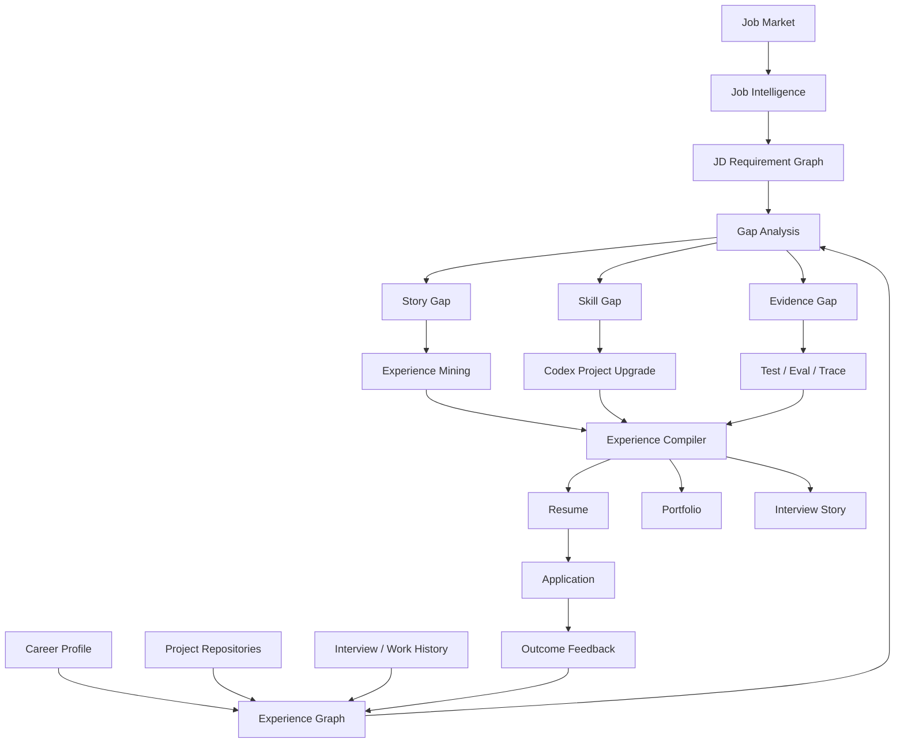
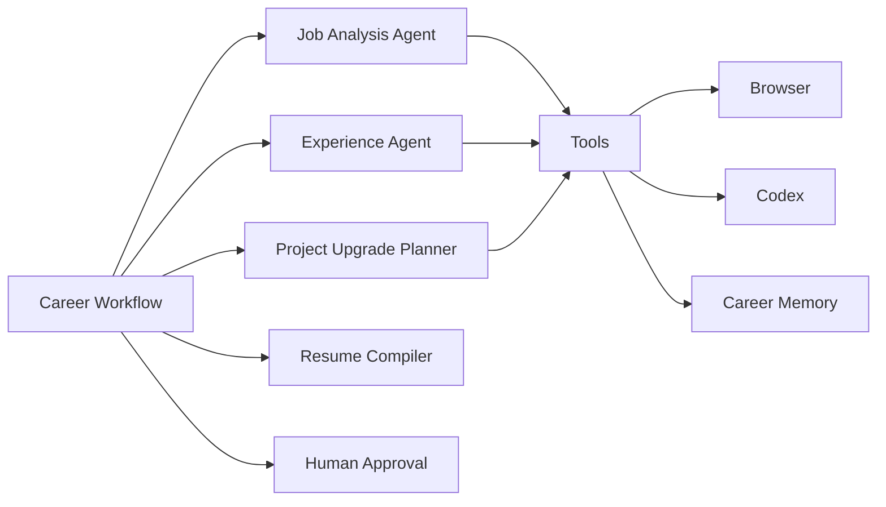
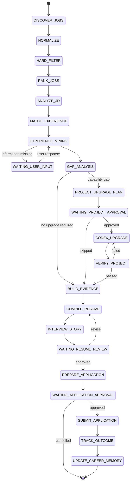
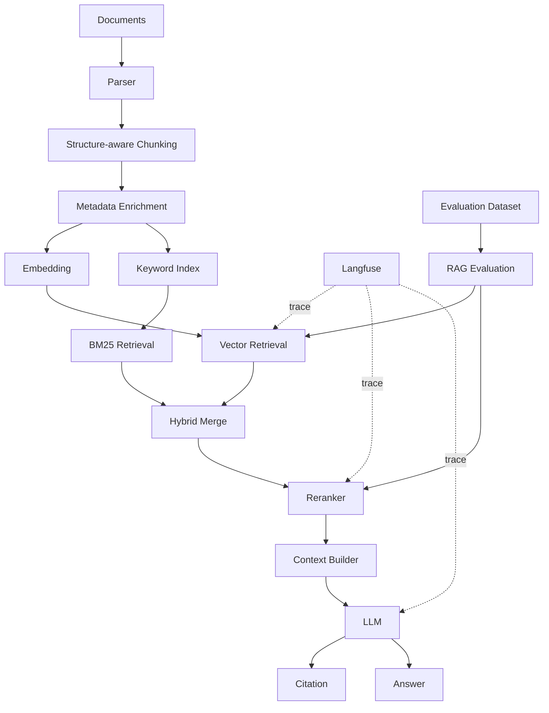
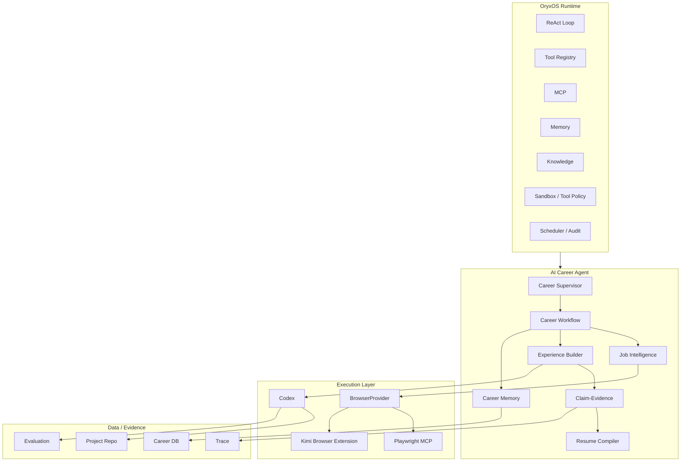

# AI Career Agent：深度调研与技术架构报告

> **技术基线**：OryxOS 作为 Agent Runtime / Harness 基座，Codex 作为技术执行 Agent，Career Workflow 负责持久化业务编排，Experience Builder 负责经历深挖与项目升级，Playwright MCP 负责浏览器执行。  
> **核心原则**：**Never fabricate experience. Upgrade experience until the claim becomes true.**  
> 不通过虚构经历获得“企业级感”，而是通过真实项目升级、证据沉淀和业务化表达，使可写入简历的能力最终成为可验证事实。

---

## 0. 文档定位

本文用于评估并设计一套面向 **AI 应用开发工程师 / AI Agent 开发工程师** 求职场景的 AI Career Agent。

系统目标不是构建一个“自动爬岗位 + 自动海投”的浏览器脚本，而是形成完整的职业能力闭环：

```text
岗位发现
→ 岗位理解
→ 能力匹配
→ 经历深挖
→ 项目升级
→ 证据验证
→ 定制简历
→ 面试故事
→ 人工确认
→ 求职投递
→ 结果反馈
→ Career Memory 持续更新
```

报告重点回答以下问题：

1. AI Career Agent 的产品边界应该如何定义；
2. Workflow、ReAct、Career Agent 与 Codex 应如何分工；
3. OryxOS 是否适合作为二次开发能力基座；
4. 浏览器层应选择 Playwright MCP、Kimi Browser Extension 还是自研；
5. 如何把普通 Demo 升级为“接近真实企业级项目”的可验证 Portfolio；
6. 如何建立 Claim-Evidence 体系，避免简历优化演变为经历虚构；
7. V1 应如何拆分阶段、模块与验收标准。

---

# 1. Executive Summary

## 1.1 最终建议

建议正式采用以下架构方向：

| 决策域 | 推荐方案 | 定位 |
|---|---|---|
| 产品核心 | **AI Career Agent** | 职业能力理解、项目升级、简历构建与反馈闭环 |
| Agent Runtime | **OryxOS** | ReAct、Tool、MCP、Memory、Knowledge、Audit 等基础能力 |
| Workflow | **Career Domain 自研持久化状态机** | 业务状态、暂停恢复、审批、重试、长流程控制 |
| Agent 推理 | **ReAct / Plan-Execute** | 用于 JD 理解、经历挖掘、Gap Analysis、项目升级规划 |
| 技术执行 | **Codex** | Repo 理解、代码改造、测试、Eval、文档与工程化升级 |
| 浏览器主引擎 | **Playwright MCP** | 结构化网页操作、登录态复用、稳定自动化 |
| 浏览器辅助 | **Kimi Browser Extension** | 快速原型、Skill 录制、真实浏览器操作、Fallback |
| 简历核心机制 | **Experience Builder + Claim-Evidence** | 将真实经历升级为可验证的企业级项目叙事 |
| 投递策略 | **Semi-Automatic + Human Gate** | 保留用户最终确认，降低误投和平台风险 |

## 1.2 核心架构判断

OryxOS 适合作为 **Agent Runtime / Harness**，但不应承担 Career Domain 的全部业务逻辑。

推荐原则是：

> **借 Runtime，不借业务。**

OryxOS 负责：

- Agent Loop
- Tool Registry
- MCP
- Memory
- Knowledge
- Scheduler
- Sandbox
- Audit
- Model Provider

Career Agent 自己负责：

- Job Intelligence
- Career Workflow
- Experience Mining
- Skill / Story / Evidence Gap
- Project Upgrade
- Claim-Evidence
- Resume Compiler
- Interview Story
- Application Tracking
- Feedback Learning

Codex 则作为可替换的 **Technical Experience Builder**，负责把“能力 Gap”真正转化为代码、测试、Eval 和工程产物。

---

# 2. 产品定位：从求职自动化升级为 Career Intelligence

## 2.1 不建议把产品定义成“自动投简历”

最初流程可能是：

```text
招聘网站抓取
→ 城市 / 薪资筛选
→ 排序
→ 简历优化
→ 自动投递
```

如果以此为核心，工程重点会自然滑向：

- DOM 适配；
- Cookie / 登录态；
- 爬取稳定性；
- 自动填表；
- 反爬兼容；
- 多站点维护。

这些能力当然必要，但它们属于 **Input / Execution Infrastructure**，并不是长期产品壁垒。

真正有价值的问题是：

> 为什么一个候选人当前只有 50% 的岗位匹配度，而系统可以帮助他把真实能力、项目深度和表达方式提升到 80%～90%？

因此更合理的产品定位是：

> **AI Career Agent：持续理解岗位市场，并帮助用户把真实经历升级到足以匹配目标岗位的程度。**

---

## 2.2 产品核心能力模型



该闭环意味着系统的核心资产并不是抓到了多少职位，而是逐渐形成：

- 用户真实能力图谱；
- 项目证据图谱；
- 岗位能力趋势；
- 项目升级历史；
- 不同简历版本；
- 投递 / 回复 / 面试结果；
- Job → Experience → Outcome 的反馈数据。

---

# 3. 市场能力信号：AI Agent 岗位更看重“可落地能力”

公开招聘页面的样本显示，AI 应用开发 / AI Agent 岗位中高频出现：

- RAG；
- AI Agent；
- LangChain / LangGraph；
- Tool Calling / Function Calling；
- Workflow；
- MCP；
- Knowledge Base；
- Multi-Agent；
- LLMOps / Evaluation；
- 企业业务场景落地；
- 工程化部署与系统集成。

这意味着候选人的竞争力不能只停留在“会某个框架”。

| 能力关键词 | 初级简历常见写法 | 面试官真正关注的深度 |
|---|---|---|
| RAG | 使用 LangChain + Milvus | Chunk、Metadata、Hybrid Retrieval、Rerank、Eval、Citation、权限、增量索引 |
| Agent | 实现智能 Agent | Planning、Routing、Tool Calling、Memory、终止条件、异常恢复、HITL |
| LangGraph | 熟悉 LangGraph | State、Node、Edge、Checkpoint、Interrupt、Subgraph、可观测性 |
| MCP | 熟悉 MCP | Tool Contract、Server / Client、权限、安全边界、错误处理 |
| 企业落地 | 企业知识库项目 | 业务背景、系统架构、非功能要求、数据安全、评测、成本与稳定性 |
| LLMOps | 使用 Langfuse | Trace、Span、Prompt Version、Token、Latency、Feedback、Evaluation |

因此简历优化不能只解决：

> “有没有关键词”。

还必须解决：

> “候选人能不能把这个能力讲成一个真实、完整、可追问的工程故事”。

---

# 4. 总体设计原则

## 4.1 Workflow Outside, Agent Inside

整个系统不应做成一个无限运行的 ReAct Loop。

宏观流程应由 **Workflow** 控制，复杂节点内部再使用 Agent。



基本原则：

> **Workflow 负责确定性和状态，Agent 负责理解和决策。**

---

## 4.2 能用规则解决的问题，不交给 Agent

| 任务 | 推荐执行方式 |
|---|---|
| 城市筛选 | Rule |
| 薪资区间 | Rule |
| 工作年限 | Rule |
| 发布时间归一化 | Code |
| 岗位去重 | Code / Embedding |
| 基础排序 | Scoring Engine |
| JD 关键能力识别 | Agent |
| JD Must-have / Nice-to-have 判断 | Agent |
| 经历匹配 | Agent |
| 用户追问 | Agent |
| 项目深化规划 | Agent |
| 项目代码升级 | Codex |
| Eval / Test | Deterministic |
| 简历 Narrative | LLM + Structured Facts |
| 最终投递 | Browser + Human Approval |

---

# 5. Career Workflow 设计

## 5.1 主状态机



---

## 5.2 Job Ranking

岗位排序建议拆成两层：

### Layer 1：Hard Filter

确定性条件，例如：

```text
city ∈ {杭州, 上海}
salary_min >= 25K
experience_required <= 5 years
```

### Layer 2：Ranking Score

示例：

```text
JobScore =
    0.35 × JDMatch
  + 0.25 × Freshness
  + 0.15 × HRActivity
  + 0.10 × SalaryFit
  + 0.10 × CompanyPreference
  + 0.05 × ResumeLeverage
```

其中 `ResumeLeverage` 表示：

> 用户已有经历经过合理升级后，是否有较高概率形成有竞争力的项目故事。

权重不应写死，应由实际投递结果逐步校准。

---

# 6. Experience Builder：系统最核心的产品能力

## 6.1 目标不是“包装成企业项目”

一个普通 RAG Demo 可能只有：

```text
PDF
→ Chunk
→ Embedding
→ Milvus
→ LLM
```

如果只是把它改写成：

> “负责企业级知识库平台建设……”

但系统和代码从未真正存在这些能力，那么本质仍然是简历文案生成。

更合理的流程是：

```text
Existing Demo
→ Experience Mining
→ Business Scenario Design
→ Engineering Gap Analysis
→ Codex Project Upgrade
→ Evaluation
→ Evidence Collection
→ Resume Narrative
```

最终实现：

> **不是把 Demo 写得像企业项目，而是把 Demo 升级成可以支撑企业级项目叙事的 Portfolio。**

---

## 6.2 “企业级”应当具体化

企业级项目不等于“代码多”。

至少应从以下维度进行检查：

### 业务层

- 明确用户角色；
- 明确业务问题；
- 明确输入数据；
- 明确价值目标；
- 明确业务约束。

### 架构层

- 清晰模块边界；
- API / Tool Contract；
- 状态管理；
- 异步任务；
- 错误处理；
- 可扩展性。

### AI 工程层

- Prompt 管理；
- RAG；
- Agent；
- Tool Calling；
- Evaluation；
- Guardrail；
- Fallback。

### 平台工程层

- 日志；
- Trace；
- Metrics；
- Token / Cost；
- Retry；
- Timeout；
- Rate Limit。

### 安全与数据层

- 权限；
- 数据隔离；
- Secret；
- Prompt Injection；
- Audit；
- PII / Sensitive Data。

### 验证层

- Test；
- Eval Dataset；
- Regression；
- Benchmark；
- Failure Cases。

---

## 6.3 示例：RAG Demo → Enterprise Knowledge Agent

### 原始项目

```text
PDF
→ Embedding
→ Milvus
→ LLM
```

### 升级目标



进一步可以加入：

- RBAC；
- 多知识库；
- 增量索引；
- Agent Router；
- MCP Tool；
- 缓存；
- Retrieval Fallback；
- Query Rewrite；
- Offline Evaluation；
- 在线反馈。

当这些能力真实存在于项目中时，简历才能从：

> “做过一个 RAG Demo”

升级为：

> “设计并实现面向企业研发知识管理场景的 RAG + Agent 知识助手”。

---

# 7. Experience Mining：先采访，再写简历

Experience Builder 的第一步不应该是生成简历，而应该是 **Information Elicitation**。

Agent 根据 JD 和现有 Experience Graph 动态追问。

## 7.1 业务维度

- 这个项目最初为什么做？
- 原始目标用户是谁？
- 如果只是 Demo，最适合迁移到什么业务场景？
- 业务流程中最痛的环节是什么？
- AI 能解决什么，不能解决什么？

## 7.2 技术维度

- Chunk 为什么这样设计？
- Top-K 为什么取这个值？
- 有没有出现检索到了错误上下文？
- 有没有遇到 Hallucination？
- 有没有处理表格、代码块、标题层级？
- 有没有观察 Retrieval Result？
- Agent Tool 失败时怎么处理？
- 如何控制循环终止？

## 7.3 决策维度

- 为什么选 Milvus？
- 为什么使用 LangGraph，而不是普通循环？
- 为什么需要 Rerank？
- 为什么 Tool 要通过 MCP 暴露？
- 哪些技术方案试过但效果不好？

## 7.4 结果维度

- 是否有真实 Eval？
- 是否有测试数据集？
- 是否有 Before / After？
- 是否有延迟、召回、准确率、Token 成本数据？

没有真实数据时，系统应该建议：

> 建立 Eval，然后跑出真实数字。

而不是：

> 让 LLM 生成一个“提升 30%”的数字。

---

# 8. Claim-Evidence：简历真实性控制层

## 8.1 Claim Level

| Level | 定义 | 是否允许进入最终简历 |
|---|---|---|
| **L0** | 用户明确提供并确认的事实 | 是 |
| **L1** | 可以直接从事实推导出的能力 | 是 |
| **L2** | 经真实项目升级后已经实现的能力 | 是 |
| **L3** | 为 Portfolio 设计的业务场景 | 可以，但必须准确表述为“面向 / 设计” |
| **L4** | 未真实发生的生产结果 | 否 |
| **L5** | 虚构公司、客户、团队、业绩、用户量 | 否 |

---

## 8.2 Evidence 类型

```text
Evidence
├── USER_STATEMENT
├── SOURCE_CODE
├── GIT_COMMIT
├── TEST
├── EVALUATION
├── ARCHITECTURE_DOCUMENT
├── TRACE
├── SCREENSHOT
└── DEMO
```

每一个重要 Resume Claim 尽量绑定 Evidence。

例如：

```yaml
claim:
  text: "基于 LangGraph 构建多节点 Agent Workflow"
  level: L2

evidence:
  - type: SOURCE_CODE
    location: src/agent/graph.py

  - type: TEST
    location: tests/agent/test_graph.py

  - type: ARCHITECTURE_DOCUMENT
    location: docs/agent-architecture.md
```

再例如：

```yaml
claim:
  text: "RAG Recall@5 从 0.68 提升至 0.84"

evidence:
  - type: EVALUATION
    location: reports/rag-eval.json
```

没有可复现 Eval 时，该数字不得进入简历。

---

# 9. 三联产出：Resume / Portfolio / Interview Story

一次完整的 Experience Upgrade 不应只输出一份简历。

应同时产出：

| 产物 | 目标 |
|---|---|
| **Resume Narrative** | 让 HR / 面试官快速理解项目价值 |
| **Portfolio Artifact** | 证明这个项目真实存在并具备工程深度 |
| **Interview Story** | 确保候选人能够讲清楚项目、决策、失败和权衡 |

## 9.1 Interview Story 模型

建议生成：

```text
Context
→ Business Problem
→ Initial Design
→ Technical Challenge
→ Investigation
→ Decision
→ Implementation
→ Evaluation
→ Trade-off
→ Retrospective
```

并自动补充面试追问题库，例如：

- 为什么使用 Hybrid Retrieval？
- Rerank 放在哪个位置？
- 为什么选择当前 Embedding Model？
- LangGraph 的状态如何持久化？
- Tool Calling 失败怎么处理？
- Agent 如何避免无限循环？
- Langfuse Trace 中记录哪些 Span？
- 如果流量扩大 10 倍，架构需要怎么调整？

真正的判断标准不是：

> “这段项目描述写得够不够漂亮”。

而是：

> “面试官沿着这段描述连续追问 20 分钟，用户是否仍然能讲清楚”。

---

# 10. Agent、Workflow、ReAct 与 Codex 的职责边界

## 10.1 Career Agent

负责“思考”：

- 这个岗位是否值得进一步处理；
- JD 真正核心要求是什么；
- 用户哪段经历最适合匹配；
- 还缺哪些信息；
- 需要问用户什么；
- 哪些能力可以通过真实项目升级补齐；
- 项目应该朝什么方向改造；
- 最终 Resume 应突出什么。

## 10.2 Career Workflow

负责“秩序”：

- 当前处于哪个阶段；
- 哪个节点已经完成；
- 当前是否等待用户；
- 是否允许进入下一阶段；
- 哪个任务失败；
- 是否可以重试；
- 是否需要人工审批；
- 进程重启后从哪里恢复。

## 10.3 Codex

负责“建设”：

- 理解 Repo；
- 制定技术改造计划；
- 修改代码；
- 添加 Test；
- 添加 Evaluation；
- 接入 Langfuse；
- 实现 MCP / Tool；
- 编写 Architecture 文档；
- 修复失败；
- 输出可验证 Evidence。

因此：

> **AI Career Agent 是产品大脑；Codex 是高能力技术执行 Sub-Agent。**

---

# 11. Codex Task Contract

不要让 Career Agent 直接对 Codex 说：

> “把这个项目做得企业级一点。”

应该生成结构化 Contract。

```json
{
  "task": "upgrade_project",
  "goal": "Upgrade existing RAG demo into an enterprise-grade knowledge agent portfolio project",
  "target_capabilities": [
    "hybrid-retrieval",
    "rerank",
    "langgraph-agent",
    "mcp-tools",
    "langfuse",
    "offline-evaluation"
  ],
  "constraints": [
    "preserve existing working behavior",
    "do not fabricate benchmark results",
    "all measurable improvements must come from real evaluation",
    "keep architecture explainable for interviews"
  ],
  "required_outputs": [
    "source_code",
    "automated_tests",
    "evaluation_dataset",
    "evaluation_report",
    "architecture_document",
    "claim_evidence_manifest"
  ]
}
```

Codex 返回：

```json
{
  "status": "completed",
  "changes": [],
  "tests": [],
  "evaluation": {},
  "evidence": [],
  "remaining_gaps": []
}
```

之后由 Career Workflow 决定：

```text
PASS
→ BUILD_EVIDENCE

FAIL
→ CODEX_FIX

PARTIAL
→ USER / AGENT DECISION
```

---

# 12. OryxOS 二开可行性评估

## 12.1 适合作为 Agent Harness

OryxOS 当前公开能力已经覆盖：

- ReAct Loop；
- Tool System；
- MCP；
- Memory；
- Knowledge；
- Scheduler；
- Sandbox；
- Audit；
- REST API；
- Web 管理能力。

同时采用：

- Java 21；
- Spring Boot 3.x；
- Maven Multi-Module；
- Apache-2.0 License。

从技术栈和模块化方向来看，与本项目高度适配。[1]

0.1.4 / 0.1.5 版本进一步补充了：

- Knowledge Base；
- Semantic Memory；
- PostgreSQL；
- Docker Sandbox；
- Provider Fallback；
- AES-GCM Credential Encryption；
- trace_id；
- REST API Key；
- SSE；
- Tool Policy。[3]

---

## 12.2 OryxOS 适配度评分

| 能力 | 适配度 | 结论 |
|---|---:|---|
| Java / Spring | 5 / 5 | 非常适合作为企业级 AI Agent 工程基座 |
| ReAct / Tool Calling | 5 / 5 | 已具备核心 Agent Runtime |
| MCP | 5 / 5 | 适合外接 Browser / External Tools |
| Memory | 4.5 / 5 | 可作为 Agent Memory，但不能替代 Career DB |
| Knowledge | 4.5 / 5 | 可承载用户项目文档、工作资料和知识检索 |
| Audit / Security | 4.5 / 5 | 与求职数据和外部工具执行场景匹配 |
| Durable Workflow | 2.5 / 5 | 仍是主要缺口 |
| HITL | 2 / 5 | Career V1 需要自己补 |
| Browser Automation | 2 / 5 | 建议直接外接 Playwright MCP |
| Sub-Agent / A2A | 2 / 5 | V1 暂时不依赖 |
| **总体** | **8 / 10** | **适合作为能力基座，不适合直接当完整 Career Workflow Engine** |

---

## 12.3 主要缺口

根据公开 Roadmap，以下能力仍是后续建设方向：[2]

- Flow；
- Sub-Agent Delegation；
- A2A；
- Browser Automation；
- Human-in-the-loop。

其中对 AI Career Agent 影响最大的不是 Sub-Agent，而是：

1. Durable Workflow；
2. HITL；
3. Browser。

Browser 可以通过 MCP 解决。

Workflow 与 HITL 则建议在 Career Domain 中先实现轻量版本。

---

# 13. OryxOS 二开策略

## 13.1 Extension First, Core Patch Last

不建议：

```text
fork OryxOS
→ 到处修改 oryxos-core
→ Career 业务和 Runtime 强耦合
```

建议：

```text
OryxOS Upstream
      ↓
Stable Extension Interfaces
      ↓
Career Agent Domain
```

优先通过：

- MCP；
- Tool；
- Spring Bean；
- REST API；
-独立 Maven Module；
- Adapter；

完成二次开发。

只有在确实缺少 Lifecycle Hook / Workflow Hook 时才改 Core。

---

## 13.2 推荐模块结构

```text
oryxos/
├── oryxos-core
├── oryxos-provider
├── oryxos-memory
├── oryxos-knowledge
├── oryxos-tool
├── oryxos-storage
└── ...

career-agent/
├── career-domain
├── career-workflow
├── career-job
├── career-experience
├── career-evidence
├── career-resume
├── career-application
├── career-browser
├── career-codex
└── career-web
```

更理想的方式是：

> **Career Agent 尽量作为独立仓库依赖 OryxOS，而不是长期维护一个深度侵入式 Fork。**

如果必须 Fork：

- 设置 `upstream` remote；
- Career 模块独立；
- Core Patch 最小化；
- Patch 单独提交；
- 避免跨模块散点修改；
- 尽量向 upstream 提交通用能力 PR。

---

# 14. Browser Architecture

## 14.1 结论

推荐：

```text
Primary:   Playwright MCP
Fallback:  Kimi Browser Extension
Avoid V1:  自研 Browser Runtime
```

---

## 14.2 Playwright MCP 的优势

Playwright MCP 通过 Accessibility Snapshot 暴露结构化页面信息，而不是依赖视觉坐标，因此更适合 Agent 长链路操作。[6]

其优势包括：

- 页面状态结构化；
- DOM / Accessibility 语义稳定；
- 浏览器操作可测试；
- 支持多标签页；
- 支持表单操作；
- 可复用 Browser Profile / Storage State；
- 可以通过 Browser Extension 连接已有 Chrome / Edge 会话。[7]

对于招聘网站这种：

```text
强登录态
+ 大量 SPA
+ 动态 DOM
+ 多标签页
+ 表单上传
```

的场景，非常合适。

---

## 14.3 Kimi Browser Extension 的角色

Kimi Browser Extension 通过：

```text
Local Agent
→ Local Bridge
→ Browser Extension
→ Chrome DevTools Protocol
→ Chrome
```

操作用户真实浏览器，可以复用登录态，并支持导航、点击、输入、截图和网页内容读取。[8]

它的突出优势是：

- 快速接入；
- 操作真实 Chrome；
- Skill 录制；
- 将重复网站操作沉淀为 Skill。[9]

因此非常适合：

- MVP 验证；
- 招聘站点流程探索；
- 快速录制操作；
- Playwright 失败时的 fallback。

但不建议让 Career Domain 直接依赖它。

---

## 14.4 BrowserProvider

```java
public interface BrowserProvider {

    void navigate(String url);

    PageSnapshot snapshot();

    void click(String ref);

    void fill(String ref, String value);

    void upload(String ref, Path file);

    Screenshot screenshot();
}
```

实现：

```text
PlaywrightMcpBrowserProvider
KimiBrowserProvider
```

其上再建立：

```java
public interface JobSiteAdapter {

    List<JobSummary> searchJobs(JobSearchCriteria criteria);

    JobDetail getJobDetail(String jobId);

    RecruiterActivity getRecruiterActivity(String jobId);

    ApplicationDraft prepareApplication(
        JobDetail job,
        ResumeVersion resume
    );
}
```

这样 Browser Provider 可以替换，而 Career Domain 无需修改。

---

# 15. 推荐总体技术架构



---

# 16. Career Data Model

## 16.1 结构化事实优先

Career Memory 不能只存在于聊天记录或 Markdown。

至少需要以下领域实体：

| Entity | 作用 |
|---|---|
| `CareerProfile` | 目标岗位、城市、薪资、公司偏好 |
| `Skill` | 能力和熟练度 |
| `Experience` | 工作 / 项目真实经历 |
| `Project` | Repo、业务场景、架构、状态 |
| `Evidence` | Claim 的验证依据 |
| `Job` | 岗位结构化信息 |
| `Requirement` | JD 能力要求 |
| `ExperienceMatch` | JD 与经历的匹配关系 |
| `Gap` | Story / Skill / Evidence Gap |
| `WorkflowInstance` | 当前流程状态 |
| `ResumeVersion` | 针对某个岗位的简历版本 |
| `Application` | 投递状态 |
| `Outcome` | 已读 / 回复 / 面试 / Offer |

---

## 16.2 OryxOS Memory 与 Career DB 的边界

### OryxOS Memory

适合存：

- 用户长期偏好；
- Agent 交互经验；
- 对话上下文；
- 语义记忆；
- 可检索 Knowledge。

### Career DB

必须存：

- 真实工作经历；
- Skills；
- Projects；
- Claims；
- Evidence；
- Jobs；
- Workflow State；
- Resume Version；
- Application / Outcome。

结论：

> **Memory 用于“记住”，Database 用于“事实”。**

---

# 17. Career Workflow 的持久化设计

由于 OryxOS 当前 Flow / HITL 尚未成为成熟核心能力，建议 V1 在 Career Domain 中维护：

```java
enum CareerStage {
    JOB_DISCOVERY,
    JOB_FILTERING,
    JD_ANALYSIS,
    EXPERIENCE_MATCHING,
    EXPERIENCE_MINING,
    GAP_ANALYSIS,
    PROJECT_UPGRADE,
    PROJECT_VERIFY,
    RESUME_BUILD,
    RESUME_REVIEW,
    APPLICATION_PREPARE,
    APPLICATION_APPROVAL,
    APPLICATION_SUBMIT,
    TRACKING
}
```

并维护：

```text
WorkflowInstance
├── workflowId
├── userId
├── targetJobId
├── currentStage
├── status
├── state
├── waitingReason
├── retryCount
├── createdAt
└── updatedAt
```

建议支持：

```text
RUNNING
WAITING_USER_INPUT
WAITING_APPROVAL
RETRYABLE_FAILED
FAILED
COMPLETED
CANCELLED
```

这样：

> 即使 Agent Session 消失、服务重启或用户一天后再回来，Workflow 仍然可以继续。

---

# 18. Human-in-the-loop

至少设置四类强制暂停点：

## 18.1 Experience Confirmation

```text
Agent:
“根据你的描述，我理解当时最大问题是 Retrieval Miss，
是否准确？”
```

## 18.2 Project Upgrade Approval

```text
Agent:
“为了匹配该岗位，建议为项目增加：
Hybrid Retrieval + Rerank + LangGraph + Eval。
是否让 Codex 执行？”
```

## 18.3 Resume Review

```text
系统已生成针对岗位 A 的 Resume Version 3。

[接受]
[修改]
[回到经历补充]
```

## 18.4 Application Approval

```text
即将向：
Company A / AI Agent Engineer

提交：
resume-company-a-v3.pdf

[确认投递]
[取消]
```

任何验证码、人机验证、平台风控：

```text
→ PAUSED_FOR_HUMAN
```

而不是尝试绕过。

---

# 19. 招聘网站自动化边界

浏览器技术可实现，并不代表平台条款允许。

公开协议中，BOSS 直聘对蜘蛛、爬虫、拟人程序等非正常浏览获取信息设置了限制；拉勾同样限制机器人、脚本自动访问以及未经许可的抓取 / 批量检索。[12][13]

因此产品应定位为：

> **Personal Career Assistant**

而不是：

> **Mass Job Scraper / Auto-Apply Bot**

推荐约束：

- 用户主动发起；
- 使用用户自己的登录会话；
- 低频；
- 只处理个人求职所需数据；
- 高风险动作人工确认；
- 不绕验证码；
- 不绕频控；
- 不规避技术保护；
- 不做多账号批量操作；
- 商业化前重新审查各目标平台最新版协议和官方开放能力。

更合适的浏览器产品模式是：

> **Bring Your Own Session**

即用户在自己的浏览器登录，Agent 在用户可见、可停止的状态下辅助操作。

---

# 20. 分阶段实施路线

## Phase 0 — OryxOS 基座验证

目标：

- 跑通 OryxOS；
- 理解 Tool / MCP / Memory / Knowledge；
- 接入一个外部 MCP；
- 验证独立 Career Module 的加载方式。

**验收标准**

- Career Module 不修改 `oryxos-core` 即可运行；
- Tool 可被 Agent 调用；
- MCP 可稳定执行；
- Audit 可记录调用链。

---

## Phase 1 — Job Intelligence MVP

范围：

```text
一个招聘网站
→ Job Search
→ Job Detail
→ Normalize
→ Hard Filter
→ Rank
→ JD Analysis
```

**验收标准**

- Job Schema 稳定；
- 浏览器细节不泄漏到 Career Domain；
- 同一 JD 多次分析结果结构一致；
- Job Rank 可解释。

---

## Phase 2 — Experience Builder MVP

实现：

- Experience Graph；
- Requirement Graph；
- Experience Match；
- Experience Mining；
- Story Gap；
- Skill Gap；
- Evidence Gap。

**验收标准**

系统可以针对一个真实 JD：

1. 找出用户最匹配的项目；
2. 指出缺失能力；
3. 主动追问；
4. 给出项目深化方案。

---

## Phase 3 — Codex Project Upgrade

实现：

```text
Career Agent
→ Upgrade Plan
→ Human Approval
→ Codex Task Contract
→ Repo Modification
→ Test
→ Eval
→ Evidence
```

**验收标准**

一个原始 RAG Demo 经过系统后具备：

- 企业业务场景；
- Hybrid Retrieval；
- Rerank；
- Agent / Workflow；
- Observability；
- Evaluation；
- Architecture 文档；
- Test。

---

## Phase 4 — Resume / Portfolio / Interview

实现：

- Claim-Evidence；
- Resume Compiler；
- Portfolio Summary；
- Interview Story；
- Follow-up Questions。

**验收标准**

每个关键 Claim：

```text
Resume Claim
→ Evidence
→ Interview Story
```

三者可以互相追溯。

---

## Phase 5 — Durable Workflow + HITL

实现：

- Workflow Persistence；
- Interrupt；
- Resume；
- Retry；
- Approval；
- Audit Event。

**验收标准**

服务重启后任务不丢；

用户 24 小时后仍可继续；

高风险动作不会自动执行。

---

## Phase 6 — Multi-site + Career Feedback

接入：

- 更多 JobSiteAdapter；
- Application Tracking；
- Interview Outcome；
- Offer Outcome。

最终形成：

```text
Job Requirement
→ Resume Strategy
→ Application
→ Outcome
→ Ranking / Experience Strategy Update
```

---

# 21. 风险清单

| 风险 | 等级 | 影响 | 控制方式 |
|---|---|---|---|
| OryxOS 版本较早 | 高 | Upstream API 变化 | Extension-first、Core Patch 最小化 |
| Flow / HITL 不成熟 | 高 | 长流程恢复困难 | Career Domain 自建持久状态机 |
| 招聘网站 DOM 变化 | 高 | Adapter 失效 | BrowserProvider + JobSiteAdapter |
| 平台自动化规则 | 高 | 限流、封禁、合规 | BYOS、低频、人工审批 |
| Resume 过度包装 | 高 | 真实性 / 面试风险 | Claim Level + Evidence Guard |
| Agent 无限循环 | 中 | Token / 成本失控 | Max Turns、Budget、Stop Condition |
| Codex 改坏项目 | 中 | Repo 不稳定 | Branch / Test / Human Approval |
| LLM 生成假指标 | 高 | 简历事实失真 | Eval 数据只能来自程序执行 |
| Career 数据敏感 | 高 | 隐私风险 | Encryption、RBAC、Data Minimization |
| Browser Tools 过多 | 中 | Agent 上下文污染 | 高层 Job Tool 封装 |

---

# 22. 核心技术决策记录

## ADR-001：OryxOS 作为 Agent Runtime

**Decision**

采用 OryxOS。

**Reason**

- Java / Spring；
- 自实现 Agent Loop；
- MCP；
- Tool；
- Memory；
- Knowledge；
- Security；
- Audit；
- 模块化。

**Constraint**

Career Domain 不依赖 OryxOS 内部实现细节。

---

## ADR-002：不采用“纯 Codex 单 Agent”架构

**Decision**

Codex 作为 Technical Sub-Agent。

**Reason**

Codex 擅长代码执行和长程 coding task，但 Career 生命周期需要独立业务状态、用户记忆、Job State 与 HITL。

---

## ADR-003：不在 V1 引入 LangGraph 主 Runtime

**Decision**

Career Workflow 第一版使用 Java 持久化状态机。

**Reason**

OryxOS 已是 Java Runtime；同时引入 Python LangGraph 会增加：

- Session 双重管理；
- State 双重持久化；
- Java/Python RPC；
- Deployment；
- Debug Complexity。

未来如果 Durable Workflow 复杂度显著上升，再重新评估。

---

## ADR-004：Playwright MCP 为 Browser Primary

**Decision**

Browser Primary 使用 Playwright MCP。

**Reason**

- Accessibility Snapshot；
- MCP；
- 登录 Profile；
- 自动化测试能力；
- 工程可控性。

Kimi Browser Extension 作为辅助能力。

---

## ADR-005：简历必须以 Evidence 为约束

**Decision**

Resume 不是自由文本生成，而是 `Structured Facts + Claims + Evidence → Narrative`。

**Reason**

这是系统区别于普通简历优化工具的核心能力，也是避免“包装演变成虚构”的关键控制点。

---

# 23. 最终结论

本项目最合理的技术路线可以概括为：

```text
OryxOS
    管 Agent Runtime

Career Workflow
    管长期业务状态

Career Agent
    管职业决策

Experience Builder
    管经历深挖与项目升级

Codex
    管真实技术建设

Playwright MCP
    管浏览器执行

Career Memory
    管用户长期职业画像

Claim-Evidence
    管真实性

Human Gate
    管不可逆动作
```

其中真正值得长期投入的产品 IP 是：

1. **Career Domain Model**
2. **Job-to-Experience Matching**
3. **Experience Mining**
4. **Experience Builder**
5. **Claim-Evidence**
6. **Career Memory / Experience Graph**
7. **Outcome Feedback Learning**

相反：

- Browser；
- LLM Provider；
- MCP Runtime；
- Coding Agent；

都应该尽可能设计为可替换基础设施。

最终目标不是：

> “帮助用户更快投更多简历”。

而是：

> **持续理解目标岗位，并帮助用户把真实经历升级到足以匹配目标岗位的程度，同时确保每一个重要项目故事都能被代码、评测、文档或真实经历所证明。**

---

# 24. 参考资料

1. **OryxOS README** — 当前能力、Java 21 / Spring Boot、Agent Harness、MCP、Memory、Knowledge、Tool、Audit  
   https://raw.githubusercontent.com/oryx-labs/oryxos/main/README.md

2. **OryxOS Vision & Roadmap** — Flow、Sub-Agent、Browser Automation、HITL 等规划  
   https://raw.githubusercontent.com/oryx-labs/oryxos/main/docs/VisionAndRoadmap.md

3. **OryxOS CHANGELOG** — 0.1.0～0.1.5 版本演进  
   https://raw.githubusercontent.com/oryx-labs/oryxos/main/CHANGELOG.md

4. **OpenAI — Unrolling the Codex agent loop**  
   https://openai.com/index/unrolling-the-codex-agent-loop/

5. **OpenAI — An open-source spec for Codex orchestration: Symphony**  
   https://openai.com/index/open-source-codex-orchestration-symphony/

6. **Microsoft Playwright MCP**  
   https://github.com/microsoft/playwright-mcp

7. **Playwright MCP Browser Extension Configuration**  
   https://github.com/microsoft/playwright.dev/blob/main/mcp/configuration/browser-extension.mdx

8. **Kimi Browser Extension — How it works**  
   https://www.kimi.com/en/help/kimi-webbridge/kimi-webbridge-how-it-works

9. **Kimi Browser Extension — Use cases / FAQ**  
   https://www.kimi.com/en/help/kimi-webbridge/kimi-webbridge-use-cases

10. **LangGraph Interrupts**  
    https://docs.langchain.com/oss/python/langgraph/interrupts

11. **LangGraph Subgraphs / Persistence**  
    https://docs.langchain.com/oss/python/langgraph/use-subgraphs

12. **BOSS 直聘用户协议**  
    https://www.zhipin.com/web/common/protocol/protocol-2019-09-30.html

13. **拉勾用户协议**  
    https://help.lagou.com/staticpage/app/statement/statement.html

14. **BOSS 直聘公开职位索引：AI 应用开发相关样本**  
    https://www.zhipin.com/zhaopin/e6edc20c9b8b6e0e03V62tm8Ew~~/

15. **BOSS 直聘公开职位索引：AI Agent / Workflow 相关样本**  
    https://m.zhipin.com/zhaopin/e050245f1d541f7c0nBy2d21EA~~/

---

> **研究说明**  
> 本文中的职位页面仅用于识别 AI 应用 / Agent 岗位的能力信号，不构成完整市场统计。招聘平台协议、开放能力和页面实现均可能变化；如将本系统商业化，应重新核对目标平台当期协议、官方 API、合作接口及数据合规要求。
