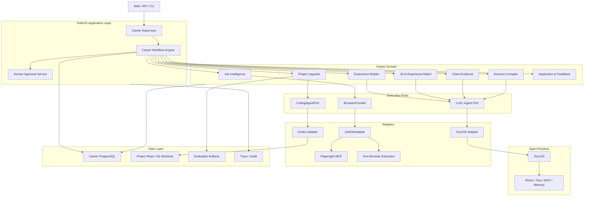
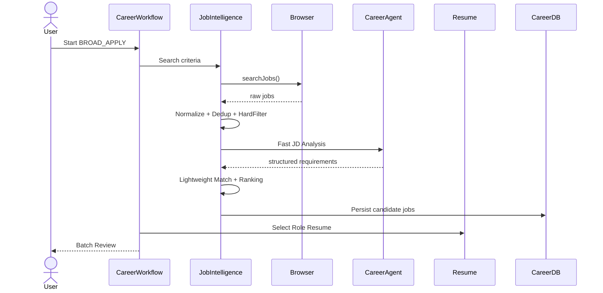
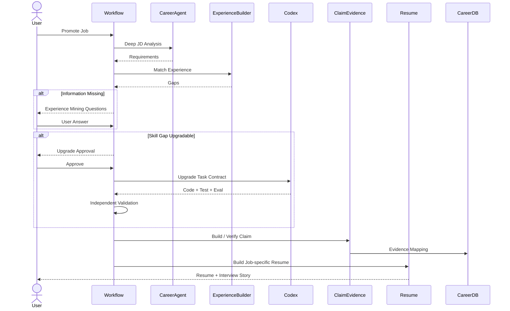

# RoleOS 技术方案

> **文档定位**：本文回答 RoleOS “How”的问题。前置输入为《AI Career Agent：深度调研与技术架构报告》和《RoleOS 需求文档》。  
> **技术基线**：OryxOS 作为 Agent Runtime / Harness；RoleOS 自己维护 Career Domain 与持久化 Workflow；Codex 作为 Coding Agent；Playwright MCP 作为主要 Browser Runtime。  
> **核心原则**：Workflow Outside, Agent Inside；Agent for Judgment, Code for Rules；Never fabricate experience. Upgrade experience until the claim becomes true.

---

# 0. 技术方案边界

RoleOS V1 目标是在 6～8 周内跑通：

```text
Job Discovery
→ JD Analysis
→ Experience Match
→ Gap Analysis
→ Experience Mining
→ Project Upgrade
→ Evidence
→ Resume / Interview Story
→ Human Approval
→ Application
→ Outcome Feedback
```

本文只覆盖支撑上述 V1 Golden Scenario 的核心技术方案。

V1 不建设：

- 通用 Workflow Engine；
- 自研 Browser Runtime；
- 自研 Coding Agent；
- 完整 Career Knowledge Graph；
- 复杂 Multi-Agent Network；
- 大规模招聘爬虫平台；
- 无人值守批量投递系统。

技术方案的目标不是把所有能力一次做完，而是形成：

> **可持续演进、状态可恢复、核心事实可信、外部执行能力可替换的 Career Agent 架构。**

---

# 1. 方案概述

## 1.1 总体形态

RoleOS V1 采用 **Java 模块化单体 + 外部执行能力** 的形态。

```text
RoleOS Spring Boot Application
│
├── RoleOS Career Domain
├── Career Workflow
├── Career Agent / OryxOS Adapter
├── Job Intelligence
├── Experience Builder
├── Claim-Evidence
├── Resume / Application
└── Career DB
        │
        ├── OryxOS Runtime
        ├── Playwright MCP
        └── Codex
```

V1 优先保持一个 RoleOS 主进程，避免过早拆微服务。

外部执行能力保持独立：

```text
Browser Execution → Playwright MCP / Kimi Browser Extension
Coding Execution  → Codex
LLM / Tool Runtime → OryxOS
```

这样既降低部署复杂度，又保持边界清晰。

---

## 1.2 技术栈

| 层 | 选择 |
|---|---|
| Language | Java 21 |
| Application | Spring Boot 3.x |
| Agent Runtime | OryxOS |
| Agent Pattern | ReAct / Plan-Execute（仅复杂节点内部） |
| Workflow | RoleOS 自研持久化状态机 |
| Persistence | PostgreSQL + Spring Data JPA |
| Schema Migration | Flyway |
| Browser | Playwright MCP |
| Browser Fallback | Kimi Browser Extension |
| Coding Agent | Codex |
| Integration | MCP / REST / Spring Adapter |
| API | Spring MVC + OpenAPI |
| Long Task Status | SSE / Polling |
| Observability | SLF4J + Micrometer + Trace ID |
| Test | JUnit + Testcontainers + Contract Test |

> OryxOS 自身的 Runtime 数据可以继续使用其默认存储；RoleOS Career DB 独立维护职业事实和 Workflow State。

---

## 1.3 关键技术决策

| # | 决策 | V1 选择 | 原因 |
|---|---|---|---|
| 1 | RoleOS 与 OryxOS 的关系 | **Runtime Adapter 隔离** | 借 Runtime，不借业务，避免 Career Domain 与 OryxOS Core 强耦合 |
| 2 | 系统形态 | **模块化单体** | V1 单用户、6～8 周，优先降低分布式复杂度 |
| 3 | Workflow | **Career Domain 持久化状态机** | 求职流程跨小时/天，需要暂停、审批、恢复 |
| 4 | Agent 使用方式 | **Workflow Outside, Agent Inside** | 宏观流程确定性，复杂语义判断交给 Agent |
| 5 | Browser | **BrowserProvider + JobSiteAdapter** | Career Domain 不依赖 Playwright/Kimi 和页面结构 |
| 6 | Coding Agent | **CodingAgentPort + CodexAdapter** | Codex 可替换，Career Domain 不绑定具体 Coding Agent |
| 7 | 数据存储 | **Career DB 独立结构化持久化** | Career Fact、Claim、Evidence、Workflow 不能只存在 Memory |
| 8 | Career Memory | **DB 管事实，Memory 管上下文** | 避免 Agent 推理污染真实职业事实 |
| 9 | Broad / Targeted | **两条成本不同的处理路径** | 海投需要低成本，定向投递需要深度处理 |
| 10 | Project Upgrade | **Git Workspace + 独立验证** | 不以 Codex 自报成功作为完成条件 |
| 11 | Claim-Evidence | **强制 Provenance** | 重要简历 Claim 可追溯到真实 Evidence |
| 12 | 外部动作 | **Human Approval Gate** | 项目重大改造、简历、正式投递保留用户最终控制 |

---

# 2. 整体架构

## 2.1 分层架构



---

## 2.2 各层职责

### Application Layer

负责：

- 接收用户命令；
- 创建 / 恢复 Career Workflow；
- 调度 Domain Service；
- 触发 Human Approval；
- 返回当前任务状态。

不负责具体 JD 分析、经历判断或页面操作。

### Career Domain

负责 RoleOS 的业务规则：

```text
Job
→ Requirement
→ Experience
→ Gap
→ Upgrade
→ Evidence
→ Resume
→ Application
→ Outcome
```

Career Domain 不允许直接依赖：

- Playwright；
- Kimi；
- Codex CLI；
- OryxOS 内部实现类。

### Agent Runtime

OryxOS 提供：

- ReAct Loop；
- Tool Registry；
- MCP；
- LLM Provider；
- Memory；
- Knowledge；
- Sandbox；
- Audit / Trace。

RoleOS 不重新实现这些能力。

### Execution Adapter

负责把 RoleOS 的业务意图转换为外部执行请求。

例如：

```text
RoleOS: searchJobs(criteria)
        ↓
JobSiteAdapter
        ↓
BrowserProvider
        ↓
Playwright MCP
```

---

# 3. OryxOS 集成方案

## 3.1 设计原则

采用：

> **Extension First, Core Patch Last**

RoleOS 独立维护 Career Domain。

推荐依赖方向：

```text
RoleOS Domain
      ↓
RoleOS Ports
      ↑
RoleOS Oryx Adapter
      ↓
OryxOS Runtime
```

只有 `roleos-runtime-oryx` 模块允许直接依赖 OryxOS API。

禁止：

```text
career-job
career-experience
career-resume
        ↓
直接 import OryxOS internal class
```

---

## 3.2 V1 Agent 形态

V1 不建设复杂 Multi-Agent Network。

采用：

```text
Career Supervisor Agent
+
多个结构化 Domain Capability
```

Career Supervisor 负责：

- 理解用户目标；
- 决定需要进入哪个 Workflow；
- 在 Experience Mining 中动态追问；
- 解释 Job Ranking / Gap；
- 对 Project Upgrade 提出规划建议。

确定性的状态流转由 Career Workflow 完成。

---

## 3.3 OryxOS Agent 配置

建议定义一个 RoleOS Agent：

```text
.oryxos/agents/roleos-career/
├── AGENT.md
├── skills/
│   ├── jd-analysis
│   ├── experience-mining
│   ├── gap-analysis
│   └── resume-writing
└── REFERENCE.md
```

其中：

- `AGENT.md` 定义 Career Supervisor 的总体原则；
- Skill 提供特定任务的 Prompt / Reference；
- 业务事实不保存在 Agent 文件中；
- Career Fact 始终从 Career DB 获取。

---

## 3.4 Agent 输出约束

关键 Agent Node 必须输出结构化结果，而不是只返回自然语言。

例如 JD Analysis：

```json
{
  "requirements": [
    {
      "capability": "RAG Engineering",
      "priority": "MUST_HAVE",
      "type": "TECHNICAL",
      "expectedDepth": "WORKING",
      "reason": "..."
    }
  ]
}
```

Experience Match：

```json
{
  "matches": [],
  "storyGaps": [],
  "skillGaps": [],
  "evidenceGaps": [],
  "recommendedAction": "EXPERIENCE_MINING"
}
```

Domain Service 校验 JSON Schema 后才能写入 Career DB。

---

# 4. Career Workflow Engine

## 4.1 为什么不直接用 ReAct 跑完整流程

Career Workflow 具有：

- 跨小时 / 天执行；
- 人工审批；
- 外部任务失败；
- 需要 Retry；
- 服务重启恢复；
- 防止重复投递；
- 状态可审计。

因此宏观流程不能依赖单个 ReAct Session。

核心原则：

> **Workflow 管状态和秩序，Agent 管理解和决策。**

---

## 4.2 Workflow Type

V1 定义三类主 Workflow：

```java
enum WorkflowType {
    BROAD_APPLY,
    TARGETED_APPLY,
    PROJECT_UPGRADE
}
```

Application Feedback 作为 Application / Outcome 的事件流程处理，不单独创建复杂 Workflow Engine。

---

## 4.3 Workflow Stage

```java
enum CareerStage {
    JOB_DISCOVERY,
    JOB_NORMALIZE,
    JOB_FILTERING,
    JD_ANALYSIS,
    EXPERIENCE_MATCHING,
    EXPERIENCE_MINING,
    GAP_ANALYSIS,
    PROJECT_UPGRADE_PLAN,
    PROJECT_UPGRADE,
    PROJECT_VERIFY,
    EVIDENCE_BUILD,
    RESUME_BUILD,
    RESUME_REVIEW,
    APPLICATION_PREPARE,
    APPLICATION_APPROVAL,
    APPLICATION_SUBMIT,
    OUTCOME_TRACKING,
    COMPLETED
}
```

---

## 4.4 Workflow Status

```java
enum WorkflowStatus {
    RUNNING,
    WAITING_USER_INPUT,
    WAITING_APPROVAL,
    PAUSED_FOR_HUMAN,
    RETRYABLE_FAILED,
    FAILED,
    COMPLETED,
    CANCELLED
}
```

---

## 4.5 WorkflowInstance

```text
WorkflowInstance
├── id
├── type
├── userId
├── targetRoleId
├── targetJobId
├── currentStage
├── status
├── stateJson
├── waitingReason
├── retryCount
├── version
├── createdAt
└── updatedAt
```

其中 `version` 用于 Optimistic Lock，避免多个请求同时恢复同一个 Workflow。

---

## 4.6 State Transition

所有状态流转通过显式 Transition 完成。

例如：

```text
EXPERIENCE_MINING
    ├── missing information
    │      → WAITING_USER_INPUT
    │
    └── enough information
           → GAP_ANALYSIS
```

禁止 Agent 自己修改 `currentStage`。

Agent 只能返回：

```text
Decision / Recommendation
```

由 Workflow Engine 根据业务规则决定 Transition。

---

## 4.7 Human Approval

统一抽象：

```text
ApprovalTask
├── approvalId
├── workflowId
├── type
├── payload
├── status
├── createdAt
└── resolvedAt
```

V1 四类强制 Approval：

```text
EXPERIENCE_CONFIRMATION
PROJECT_UPGRADE_APPROVAL
RESUME_APPROVAL
APPLICATION_APPROVAL
```

Browser 遇到验证码 / 人机验证时：

```text
PAUSED_FOR_HUMAN
```

---

## 4.8 Idempotency

以下操作必须具备幂等保护：

- Job 入库；
- Project Upgrade 创建；
- Codex Task 执行；
- Resume Version 创建；
- Application Submit。

Application 使用：

```text
userId + jobId + resumeVersionId
```

形成幂等键，防止 Workflow Retry 导致重复投递。

---

# 5. Job Intelligence

## 5.1 模块结构

```text
career-job
├── JobDiscoveryService
├── JobNormalizationService
├── JobDedupService
├── JobFilterService
├── JdAnalysisService
├── BroadApplyScoringService
├── TargetedApplyScoringService
└── JobStrategyService
```

---

## 5.2 Job Discovery

统一入口：

```java
interface JobSource {
    List<JobSummary> search(JobSearchCriteria criteria);
    JobDetail detail(String externalJobId);
}
```

招聘网站实现：

```text
BossJobSiteAdapter
LagouJobSiteAdapter
FutureJobSiteAdapter
```

V1 只实现一个真实 Source，第二个 Source 不阻塞 Golden Scenario。

---

## 5.3 Job Normalize

所有站点数据统一进入 Canonical Job Schema：

```text
Job
├── source
├── externalId
├── title
├── company
├── city
├── salaryMin
├── salaryMax
├── salaryMonths
├── experienceMin
├── experienceMax
├── education
├── jdRaw
├── publishTime
├── recruiterActivity
├── sourceUrl
└── contentHash
```

原始页面数据额外保存在 `raw_payload`，方便解析逻辑调整后重放。

---

## 5.4 Job 去重

按两层处理：

### 第一层：强标识

```text
source + externalId
```

### 第二层：跨来源近似去重

组合：

```text
companyNormalized
+ titleNormalized
+ city
+ jdContentHash
```

V1 不引入复杂 Embedding Dedup。

---

## 5.5 Hard Filter

纯代码规则：

```text
City Rule
Salary Rule
Experience Rule
Role Rule
Blacklist Rule
```

规则输出：

```text
PASS
REJECT
UNKNOWN
```

`UNKNOWN` 允许进入后续分析，不直接丢弃。

---

## 5.6 Broad Apply Pipeline

```text
Discovery
→ Normalize
→ Dedup
→ Hard Filter
→ Fast JD Analysis
→ Lightweight Match
→ BroadApplyScore
→ Role Resume
```

Broad Apply 目标是低成本覆盖。

Agent 调用使用小上下文和结构化输出，不执行 Experience Mining / Project Upgrade。

---

## 5.7 Targeted Apply Pipeline

```text
Target Job
→ Deep JD Analysis
→ Experience Retrieval
→ Deep Match
→ Gap Analysis
→ Experience Mining
→ Upgrade Decision
```

只有 Targeted Apply 进入完整 Career Intelligence 链路。

---

## 5.8 Ranking Engine

V1 使用可解释 Scoring Engine，而不是 ML Ranking Model。

Broad：

```text
BroadApplyScore =
    w1 * BasicMatch
  + w2 * Freshness
  + w3 * RecruiterActivity
  + w4 * SalaryFit
  - w5 * ApplicationCost
```

Targeted：

```text
TargetedScore =
    w1 * DeepJDMatch
  + w2 * CareerGoalFit
  + w3 * CompanyValue
  + w4 * SalaryValue
  + w5 * ExperienceLeverage
  + w6 * UpgradeFeasibility
```

权重存配置表并带 `score_version`。

后续通过 Application Outcome 校准，不写死在代码中。

---

## 5.9 JD Analysis Cache

避免重复 Token 消耗：

```text
Cache Key =
JD Content Hash
+ Analysis Mode
+ Prompt Version
+ Model Version
```

同一 JD 未变化时优先复用。

---

# 6. JD & Experience Match

## 6.1 Requirement Model

```text
Requirement
├── jobId
├── type
├── capability
├── priority
├── expectedDepth
├── expectedEvidence
├── sourceText
└── confidence
```

必须保留 `sourceText`，使 Requirement 可以追溯到 JD 原文。

---

## 6.2 Experience Retrieval

V1 不上完整 Knowledge Graph。

优先使用：

```text
Capability Tag
Skill Tag
Project Type
Business Context
Keyword / Full Text
Existing Evidence
```

构造候选 Experience，再交给 Agent 做最终语义判断。

当用户数据规模增长后再考虑 Embedding / Graph Retrieval。

---

## 6.3 Match Engine

输出：

```text
MATCHED
PARTIAL_MATCH
UPGRADABLE
NOT_MATCHED
UNKNOWN
```

以及：

```text
matchScore
reason
supportingExperienceIds
gapIds
```

Agent 负责语义判断，代码负责结果校验和持久化。

---

## 6.4 Gap Engine

三类：

```text
STORY_GAP
SKILL_GAP
EVIDENCE_GAP
```

每个 Gap 记录：

```text
Gap
├── requirementId
├── projectId
├── type
├── severity
├── reason
├── upgradeFeasibility
└── status
```

---

# 7. Experience Builder

## 7.1 Experience Mining

Experience Mining 不是普通聊天，而是：

```text
Requirement
+
Current Experience Facts
+
Missing Fields
        ↓
Question Planner
        ↓
User Answer
        ↓
Fact Extraction
        ↓
User Confirmation
        ↓
Career DB
```

---

## 7.2 Question Planner

问题优先级：

```text
P0: 决定是否匹配岗位的信息
P1: 决定 Claim 深度的信息
P2: 仅用于润色的信息
```

每轮只询问少量 P0 / P1 问题，避免无限追问。

---

## 7.3 Stop Condition

Experience Mining 满足以下条件即可结束：

```text
核心 Requirement 已可判断
+
项目职责明确
+
关键 Problem / Decision / Result 足够形成 Story
+
剩余未知信息不会改变当前投递决策
```

不追求把用户所有历史都采访完整。

---

## 7.4 Fact Provenance

新信息写入 Career DB 前必须带来源：

```text
USER_CONFIRMED
SOURCE_CODE
AGENT_INFERENCE
DESIGNED_SCENARIO
PROJECT_UPGRADE
```

其中：

```text
AGENT_INFERENCE
```

不能自动升级为 Career Fact。

需要用户确认或 Evidence 才能成为可用事实。

---

## 7.5 Experience Asset

Experience Builder 输出：

```text
ExperienceAsset
├── refinedFacts
├── story
├── matchedRequirements
├── remainingGaps
├── upgradeCandidates
├── candidateClaims
└── evidenceRequirements
```

它是 Project Upgrade 和 Resume Compiler 的统一输入。

---

# 8. Project Upgrade 与 Codex

## 8.1 核心原则

Codex 是技术执行 Agent。

RoleOS 决定：

```text
为什么改
改什么
什么算完成
需要什么 Evidence
```

Codex 决定：

```text
如何修改代码
```

---

## 8.2 CodingAgentPort

```java
interface CodingAgentPort {

    UpgradeExecution start(UpgradeTaskContract contract);

    UpgradeExecutionStatus status(String executionId);

    UpgradeExecutionResult result(String executionId);
}
```

V1 实现：

```text
CodexAdapter
```

未来可替换其他 Coding Agent。

---

## 8.3 Upgrade Task Contract

RoleOS 必须向 Codex 发送结构化 Contract：

```json
{
  "task": "upgrade_project",
  "projectPath": "...",
  "goal": "...",
  "targetCapabilities": [
    "hybrid-retrieval",
    "rerank",
    "mcp-tools",
    "evaluation"
  ],
  "constraints": [
    "preserve existing behavior",
    "do not fabricate benchmark results",
    "all measurable improvements require real evaluation"
  ],
  "requiredOutputs": [
    "source_code",
    "automated_tests",
    "evaluation_report",
    "architecture_document",
    "claim_evidence_manifest"
  ],
  "validationCommands": [
    "./mvnw test"
  ]
}
```

禁止发送：

```text
“把项目做得企业级一点”
```

这样的模糊指令。

---

## 8.4 Project Workspace

Codex 不直接在用户主分支无保护修改。

推荐：

```text
Original Repo
     ↓
Git Worktree / Upgrade Branch
     ↓
Codex Modification
     ↓
Validation
     ↓
Human Review
     ↓
Merge / Keep
```

Branch：

```text
roleos/upgrade/{upgradeId}
```

---

## 8.5 Validation Runner

Codex 返回 completed 不代表 Upgrade 成功。

RoleOS 独立执行：

```text
Build
Unit Test
Integration Test
Evaluation
Required Artifact Check
```

结果：

```text
PASS
PARTIAL
FAIL
```

只有 PASS / 已确认 PARTIAL 中完成的能力才能产生 Verified Evidence。

---

## 8.6 Evidence Collector

自动采集：

```text
SOURCE_CODE
GIT_COMMIT
TEST
EVALUATION
ARCHITECTURE_DOCUMENT
TRACE
DEMO
```

例如：

```text
Evidence
├── type: SOURCE_CODE
├── projectId
├── upgradeId
├── uri: src/main/...
├── hash
├── createdAt
└── verificationStatus
```

---

# 9. Claim-Evidence 与 Resume Compiler

## 9.1 Claim Model

```text
Claim
├── text
├── level
├── status
├── experienceId
├── projectId
├── sourceType
└── createdAt
```

Claim Level：

```text
L0 用户确认事实
L1 从事实直接推导
L2 Project Upgrade 后真实实现
L3 Designed Portfolio Scenario
L4 未发生生产结果（禁止）
L5 虚构主体 / 数据（禁止）
```

---

## 9.2 Claim-Evidence Policy

```text
VERIFIED
SUPPORTED
NEEDS_CONFIRMATION
UNSUPPORTED
```

规则：

```text
L0 + USER_CONFIRMED → SUPPORTED
L2 + CODE + TEST     → VERIFIED
量化结果 + EVAL      → VERIFIED
无来源               → UNSUPPORTED
L4 / L5              → REJECT
```

Resume Compiler 默认只能选：

```text
VERIFIED / SUPPORTED
```

---

## 9.3 Resume Compiler

输入：

```text
Target Job
+
Requirement
+
Career Profile
+
Experience Asset
+
Verified Claim
```

输出：

```text
ResumeVersion
+
Claim-Evidence Mapping
+
JD Coverage
+
Interview Story
```

---

## 9.4 Broad / Targeted Resume

Broad：

```text
Master Career Profile
→ Role Resume
→ Lightweight Job Adaptation
```

Targeted：

```text
Target Job
→ Requirement Priority
→ Experience Selection
→ Verified Claim Selection
→ Job-specific Resume
```

---

## 9.5 Resume Versioning

Resume 不覆盖更新。

```text
ResumeVersion
├── id
├── targetRoleId
├── targetJobId
├── type
├── version
├── content
├── claimIds
├── status
└── createdAt
```

用户编辑生成新 Version，Career Fact 本身保持不变。

---

# 10. Browser Architecture

## 10.1 总体方案

```text
Primary:  Playwright MCP
Fallback: Kimi Browser Extension
V1:       不自研 Browser Runtime
```

Career Domain 只依赖 Browser Port。

---

## 10.2 BrowserProvider

```java
interface BrowserProvider {

    BrowserSession open(BrowserSessionConfig config);

    PageSnapshot snapshot(BrowserSession session);

    void navigate(BrowserSession session, String url);

    void click(BrowserSession session, ElementRef ref);

    void fill(BrowserSession session, ElementRef ref, String value);

    void upload(BrowserSession session, ElementRef ref, Path file);

    Screenshot screenshot(BrowserSession session);
}
```

---

## 10.3 JobSiteAdapter

BrowserProvider 解决“怎么操作网页”。

JobSiteAdapter 解决“这个招聘网站怎么完成业务动作”。

```java
interface JobSiteAdapter {

    List<JobSummary> searchJobs(JobSearchCriteria criteria);

    JobDetail getJobDetail(String externalJobId);

    RecruiterActivity getRecruiterActivity(String externalJobId);

    ApplicationDraft prepareApplication(
        JobDetail job,
        ResumeVersion resume
    );

    SubmitResult submit(
        ApplicationDraft draft,
        HumanApprovalToken approval
    );
}
```

Career Domain 不允许出现：

```text
CSS Selector
XPath
Playwright Page
Chrome DevTools
```

---

## 10.4 Browser Session

采用：

> **Bring Your Own Session**

用户在自己的浏览器完成登录，RoleOS 使用用户可见、可停止的会话。

Career DB 不保存招聘网站密码。

Session Credential 与 Cookie 由 Browser Runtime 管理。

---

## 10.5 Human Gate

以下情况立即暂停：

```text
Captcha
Human Verification
Unexpected Confirmation
Sensitive Information
Platform Risk Warning
```

不尝试自动绕过。

---

# 11. Career Memory 与数据持久化

## 11.1 数据边界

```text
Career DB
→ 事实

OryxOS Memory
→ 上下文 / 偏好 / 交互经验
```

Career DB 必须保存：

- Career Profile；
- Experience；
- Project；
- Skill / Capability；
- Job / Requirement；
- Match / Gap；
- Upgrade；
- Claim / Evidence；
- Workflow；
- Resume Version；
- Application / Outcome。

---

## 11.2 PostgreSQL

RoleOS V1 使用 PostgreSQL 作为 Career DB。

原因：

- Domain Entity 数量较多；
- Workflow State 需要可靠事务；
- 数据结构会频繁演进；
- JSONB 适合保存 Raw JD / Structured Agent Output；
- 后续可以自然扩展全文 / 向量检索。

Schema 由 Flyway 管理。

---

## 11.3 核心表

```text
career_profiles
roles
career_profile_roles

jobs
job_requirements

experiences
projects
skills
project_skills
capabilities

experience_matches
gaps

workflow_instances
workflow_events
approval_tasks

project_upgrades
upgrade_executions

claims
evidence
claim_evidence

resume_versions

applications
outcomes
career_feedback
```

---

## 11.4 Audit / Provenance

以下写操作必须记录：

```text
Career Fact Change
Workflow Transition
Human Approval
Agent Decision
Codex Execution
Browser Submit
Claim Verification
```

建议统一：

```text
AuditEvent
├── traceId
├── workflowId
├── actorType
├── action
├── resourceType
├── resourceId
├── before
├── after
└── createdAt
```

---

# 12. Web API 与交互层

## 12.1 API 原则

Controller 只负责：

```text
Parameter Validation
Authentication Context
Response Mapping
```

业务逻辑全部进入 Application / Domain Service。

---

## 12.2 V1 API

### Career Profile

```text
GET    /api/v1/career-profile
PUT    /api/v1/career-profile
```

### Job

```text
POST   /api/v1/jobs/search
GET    /api/v1/jobs
GET    /api/v1/jobs/{id}
POST   /api/v1/jobs/{id}/promote
```

### Workflow

```text
POST   /api/v1/workflows
GET    /api/v1/workflows/{id}
POST   /api/v1/workflows/{id}/resume
POST   /api/v1/workflows/{id}/cancel
```

### Approval

```text
GET    /api/v1/approvals
POST   /api/v1/approvals/{id}/approve
POST   /api/v1/approvals/{id}/reject
```

### Experience / Project

```text
GET    /api/v1/experiences
POST   /api/v1/experiences
GET    /api/v1/projects/{id}
POST   /api/v1/projects/{id}/upgrades
```

### Resume

```text
GET    /api/v1/resumes
GET    /api/v1/resumes/{id}
POST   /api/v1/resumes/{id}/approve
```

### Application

```text
POST   /api/v1/applications
GET    /api/v1/applications
PUT    /api/v1/applications/{id}/outcome
```

---

## 12.3 长任务状态

Project Upgrade / Deep Analysis 等任务不能依赖单个 HTTP 长连接。

API 返回：

```text
202 Accepted
+
workflowId
```

前端通过：

```text
GET /workflows/{id}
```

或 SSE 获取状态更新。

---

# 13. 项目工程结构

RoleOS 推荐独立 Maven 多模块仓库：

```text
roleos/
├── roleos-domain
├── roleos-application
├── roleos-workflow
├── roleos-job
├── roleos-experience
├── roleos-upgrade
├── roleos-evidence
├── roleos-resume
├── roleos-application-tracking
├── roleos-browser
├── roleos-codex
├── roleos-runtime-oryx
├── roleos-storage
├── roleos-web
└── roleos-boot
```

模块职责：

| Module | 职责 |
|---|---|
| `roleos-domain` | 核心 Entity / Value Object / Domain Rule / Port |
| `roleos-application` | Use Case、事务边界、领域服务编排 |
| `roleos-workflow` | Workflow State Machine、Transition、Approval、Retry |
| `roleos-job` | Job Discovery、Normalize、Filter、Ranking、JD Analysis |
| `roleos-experience` | Experience Retrieval、Match、Gap、Mining |
| `roleos-upgrade` | Upgrade Plan、Validation、Evidence Collection |
| `roleos-evidence` | Claim、Evidence、Policy、Traceability |
| `roleos-resume` | Role Resume、Job Resume、Interview Story |
| `roleos-application-tracking` | Application、Outcome、Feedback |
| `roleos-browser` | BrowserProvider、JobSiteAdapter、Playwright/Kimi Adapter |
| `roleos-codex` | CodingAgentPort、CodexAdapter、Workspace Manager |
| `roleos-runtime-oryx` | OryxOS Runtime 适配，唯一直接依赖 OryxOS 的业务模块 |
| `roleos-storage` | JPA Repository、PostgreSQL、Flyway |
| `roleos-web` | REST API、SSE、异常处理、OpenAPI |
| `roleos-boot` | Spring Boot 启动和依赖聚合 |

依赖原则：

```text
Domain
  ↑
Application
  ↑
Adapter
```

Domain 不反向依赖 Adapter。

---

# 14. 关键端到端流程

## 14.1 Broad Apply



---

## 14.2 Targeted Apply



---

## 14.3 Project Upgrade

```text
Gap
→ Upgrade Feasibility
→ Upgrade Plan
→ Human Approval
→ Git Worktree
→ Codex
→ Validation Runner
→ Evidence Collector
→ Capability Update
```

失败处理：

```text
PASS
→ EVIDENCE_BUILD

PARTIAL
→ USER / AGENT DECISION

FAIL
→ RETRY / ABORT
```

---

## 14.4 Application Feedback

```text
Resume Approved
→ Prepare Application
→ Human Approval
→ Browser Submit
→ Application Record
→ Outcome
→ Career Feedback
→ Ranking / Resume / Experience Strategy
```

Outcome 不直接修改 Career Fact。

---

# 15. 可观测性、成本与安全

## 15.1 Trace

全链路统一：

```text
traceId
workflowId
jobId
```

向：

- OryxOS Agent Call；
- Browser Call；
- Codex Execution；
- Validation；
- Application Submit；

传播。

---

## 15.2 成本记录

记录：

```text
LLM Token
LLM Cost
Browser Calls
Codex Execution Time
Evaluation Time
Workflow Duration
```

Broad / Targeted 分开统计。

---

## 15.3 Sensitive Data

禁止把以下内容写入普通日志：

- Resume PII；
- 招聘网站 Cookie；
- Token；
- API Key；
- 用户私密工作信息全文。

日志默认做字段 Redaction。

---

## 15.4 Secret

V1：

```text
Environment Variable
或
OryxOS Credential / Secret Mechanism
```

Career DB 不明文保存 Credential。

---

## 15.5 Browser 风险控制

- 只使用用户自己的 Session；
- 低频个人使用；
- 不绕验证码；
- 不绕频控；
- 不做多账号；
- 正式 Submit 经过 Approval。

---

## 15.6 Coding Agent 风险控制

- Repo Allowlist；
- Git Worktree 隔离；
- Command Allowlist；
- Execution Timeout；
- 禁止读取工作区外文件；
- 高风险命令需人工确认；
- Merge 前展示 Diff。

---

# 16. 测试方案

## 16.1 Unit Test

重点覆盖：

- Salary / City Filter；
- Job Score；
- Workflow Transition；
- Claim Policy；
- Gap Routing；
- Idempotency。

---

## 16.2 Agent Contract Test

固定 JD / Experience Fixture，验证：

```text
Structured Output Schema
Requirement Priority
Gap Type
No Fabricated Fact
```

重点验证结构稳定性，不要求自然语言完全一致。

---

## 16.3 Adapter Contract Test

同一套 Contract Test 运行于：

```text
FakeBrowserProvider
PlaywrightMcpBrowserProvider
```

以及：

```text
FakeCodingAgent
CodexAdapter
```

保证替换 Adapter 不改变 Domain 行为。

---

## 16.4 Workflow Recovery Test

必须验证：

```text
Start Workflow
→ WAITING_APPROVAL
→ Restart Service
→ Resume
→ Continue
```

以及 Retry 不产生重复 Application。

---

## 16.5 Golden Scenario E2E

使用：

- 真实 JD；
- 真实 Career Profile；
- 真实 Project Repo；

完整跑：

```text
Job
→ Match
→ Mining
→ Upgrade
→ Evidence
→ Resume
→ Approval
→ Application
```

V1 发布前必须至少成功一次。

---

# 17. 部署方案

## 17.1 V1 Local-first

推荐 Docker Compose：

```text
RoleOS
PostgreSQL
Playwright MCP
```

Codex 使用本机已登录环境。

OryxOS 作为 RoleOS Runtime Dependency / 同进程 Runtime Adapter 接入。

如果实际 OryxOS 版本不方便以依赖形式嵌入，则保持接口不变，改为：

```text
RoleOS
→ OryxOS REST / MCP
```

Career Domain 不受影响。

---

## 17.2 Workspace

建议：

```text
~/.roleos/
├── config/
├── browser/
├── projects/
├── artifacts/
├── resumes/
└── logs/
```

项目源码本身不复制进 DB，只记录：

```text
repoPath
remoteUrl
commit
upgradeBranch
```

---

# 18. 6～8 周实施计划

## Week 1：基础骨架 + OryxOS 集成

实现：

- Maven Multi-module；
- Career Domain；
- PostgreSQL + Flyway；
- WorkflowInstance；
- OryxOS Adapter；
- Career Supervisor Agent。

可演示：

```text
导入 Career Profile
+
输入 JD
+
Agent 输出结构化 Requirement
```

---

## Week 2：Job Intelligence

实现：

- 一个 JobSiteAdapter；
- Playwright MCP；
- Normalize / Dedup / Hard Filter；
- Broad / Targeted Strategy；
- Ranking。

可演示：

```text
真实招聘页面
→ Candidate Jobs
→ Ranking
```

---

## Week 3：Experience Match

实现：

- Requirement；
- Experience Retrieval；
- Match；
- Story / Skill / Evidence Gap；
- Upgrade Feasibility。

可演示：

```text
真实 JD
→ 找到最匹配 Project
→ 输出可解释 Gap
```

---

## Week 4：Experience Builder + HITL

实现：

- Question Planner；
- Mining Stop Condition；
- Fact Provenance；
- Experience Confirmation；
- Upgrade Plan。

可演示：

```text
零散项目描述
→ Agent 定向追问
→ User Confirmation
→ Experience Asset
```

---

## Week 5：Codex Project Upgrade

实现：

- CodingAgentPort；
- CodexAdapter；
- Git Worktree；
- Upgrade Contract；
- Validation Runner；
- Evidence Collector。

可演示：

```text
Skill Gap
→ Codex 修改真实 Repo
→ Test / Eval
→ Evidence
```

---

## Week 6：Claim-Evidence + Resume

实现：

- Claim Level；
- Claim Policy；
- Resume Version；
- Role Resume；
- Job-specific Resume；
- Interview Story。

可演示：

```text
Resume Claim
→ Evidence
→ Interview Story
```

三者互相追溯。

---

## Week 7：Application + Feedback

实现：

- Application Preparation；
- Browser Submit Gate；
- Outcome；
- Career Feedback；
- Broad / Targeted Metrics。

可演示：

```text
Approved Resume
→ Application
→ Outcome
→ Feedback
```

---

## Week 8：集成与发布验收

完成：

- Workflow Recovery；
- Trace；
- Cost；
- Error Handling；
- Prompt Versioning；
- E2E Test；
- Golden Scenario。

---

# 19. V1 技术验收

V1 必须满足：

- Job Source 可以通过 Adapter 替换；
- Career Domain 不依赖 Playwright / Codex / OryxOS 内部类；
- Broad / Targeted 使用不同分析成本；
- Workflow 服务重启后可以恢复；
- Human Approval 可以暂停 / 继续任务；
- Agent Output 经过 Schema Validation 后才能写 Career Fact；
- Codex Upgrade 必须经过独立 Test / Eval；
- Claim 可追溯到 Experience / Evidence；
- Application Submit 具备幂等保护；
- 关键调用具备 Trace ID；
- Golden Scenario 完整跑通。

最终验收链路：

```text
真实 Job
→ JD Requirement
→ Experience Match
→ Experience Mining
→ Gap
→ Codex Upgrade
→ Validation
→ Evidence
→ Resume
→ Interview Story
→ Human Approval
→ Application
→ Outcome
```

---

# 20. 风险与未决技术决策

## 20.1 当前风险

### OryxOS Upstream 变化快

应对：

```text
RoleOS Domain
→ Stable Port
→ OryxOS Adapter
```

减少 Core Patch。

### 招聘页面变化

页面逻辑限制在 `JobSiteAdapter`，不污染 Domain。

### Agent 输出不稳定

所有关键 Agent 输出使用 JSON Schema + Validation + Prompt Version。

### Codex 修改不可控

Git Worktree + Validation Runner + Human Review。

### Workflow 重试造成重复外部动作

Application / Codex Execution 使用 Idempotency Key。

### Experience 被 Agent 污染

Fact Provenance + Human Confirmation + Claim Policy。

---

## 20.2 未决技术决策

以下事项不阻塞当前架构，可在对应周开始前确认：

1. **首个 Job Source**：决定第一个 `JobSiteAdapter`。
2. **Codex Invocation Mode**：优先 Codex CLI，本地执行；如后续提供稳定 SDK / MCP 再替换 Adapter。
3. **前端形态**：V1 可以先 API + 简单管理页面，完整 UI 不作为技术闭环阻塞项。
4. **Resume Renderer**：V1 先 Markdown / HTML → PDF，后续再支持复杂模板。
5. **Embedding Retrieval**：V1 先结构化 + Full Text；数据量增加后再引入 pgvector / Knowledge Graph。
6. **OryxOS 部署形态**：首选同 JVM Runtime Adapter；如依赖发布形态受限，降级为 REST / MCP Sidecar，不改变 Domain。

---

# 21. 总结

RoleOS V1 的技术核心不是“再实现一套 Agent Framework”，而是把 Career Domain 建在成熟 Agent Runtime 之上。

最终职责边界：

```text
OryxOS
→ Agent Runtime / Tool / MCP / Memory / Audit

Career Workflow
→ 长流程状态 / 暂停恢复 / Retry / Approval

Career Agent
→ JD理解 / Experience Mining / Gap判断 / 规划

RoleOS Domain
→ Career Fact / Job / Experience / Evidence / Application

Codex
→ 真实项目工程升级

BrowserProvider
→ 网页执行

Career DB
→ 结构化事实

Claim-Evidence
→ 真实性边界
```

最重要的架构原则是：

> **Runtime 可替换、Browser 可替换、Coding Agent 可替换，但 Career Domain 和用户职业事实必须稳定。**

V1 只要稳定跑通：

```text
Job
→ Experience
→ Upgrade
→ Evidence
→ Resume
→ Application
→ Feedback
```

即可进入下一阶段。
